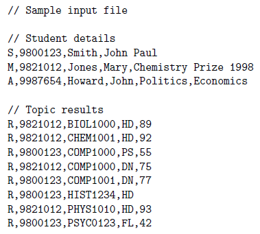
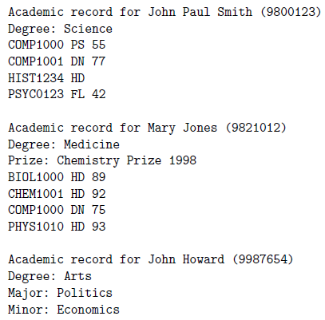

This Assignment is divided into four stages. The overall task is to write a scaled-down student database for a
university, containing the following information:

- Every student has:
    - a student number (a seven digit integer)
    - a family name
    - given name(s)
    - a degree (one of "Science", "Arts" or "Medicine")
    - results for each topic
- Each topic result contains:
    - a topic code (8 characters, e.g. COMP2008)
    - the grade ("<samp>FL</samp>","<samp>PS</samp>","<samp>CR</samp>","<samp>DN</samp>" or "<samp>HD</samp>")
    - a mark (0 - 100), which is optional
- Medicine students also have a list of (zero or more) prizes
- Arts students have a major and a minor

You are required to read in the student information from a file in the following format:

- Each line of input is either a student details line, a topic result line, or a comment
- Each data field in each line is separated by commas (like an Excel .csv - file)
- The fields in a student details line are in the following order:
    - a character '<samp>A</samp>', '<samp>M</samp>' or '<samp>S</samp>' representing the degree (arts, medicine or
      science respectively)
    - the student number
    - the family name
    - the given names (separated by spaces)
    - a (possibly empty) list of prizes, separated by commas (only if the degree is medicine)
    - the major (only if the degree is arts)
    - the minor (only if the degree is arts)
- Topic results appear in the following order (separated by commas):
    - the letter '<samp>R</samp>' (upper case)
    - the student number
        - the topic code
        - the grade
        - the mark (if it exists)
- Prizes for medical students are as follows:
    - an input line beginning with a '<samp>P</samp>' indicates a new prize
    - the second field is the name of the prize
    - the third field is the topics that the prize is awarded for
        - e.g. <samp>MMED2</samp> means the prize is awarded for performance in all topics with a code beginning
          with <samp>MMED2</samp>
    - the fourth field, min, is the minimum number of topics attempted which match the third field
    - the prize is awarded to the medical student who has the highest average mark in their best min matching topics
        - e.g. for the input line <samp>P,Neuroscience 1 Prize,MMED1904,1</samp>, the prize goes to the student with the
          highest mark in <samp>MMED1904</samp>
        - e.g. for the input line <samp>P,3rd Year Medicine Prize,MMED3,5</samp>, the prize goes to the student with the
          highest average mark in their best 5 <samp>MMED3xxx</samp> topics
        - a prize description may appear anywhere within the input file
        - prizes should be calculated and added to the students' prize lists in the order the prize descriptions appear,
          and after any prizes in the student details line
        - there will be no more than 10 prizes

You are required to print, and write to file, an academic record for each student, with the following requirements:

- students appear in the order that the student details lines appear in the input file
- topic results for each student appear in the same order as they appear in the input file
- each academic record contains the following lines of output, in order:
    - the string "_Academic record for_" followed by the given name(s), the family name, and the student number in
      parentheses (each separated by spaces)
    - the string "Degree: " followed by the degree
    - the string "Major: " followed by the major (if applicable)
    - the string "Minor: " followed by the minor (if applicable)
    - for each prize, the string "Prize: " followed by the prize name
    - for each topic result, the topic code, grade and mark (if given), separated by spaces
    - a blank line, to indicate the end of that student's record

You may make the following assumptions:

- each student record occurs before any of that student's results
- no student attempts more than 40 topics
- no student is awarded more than 10 prizes
- there are no more than 1000 students
- any line _**not**_ beginning with '<samp>A</samp>', '<samp>M</samp>', '<samp>P</samp>', '<samp>R</samp>'
  or '<samp>S</samp>' is a comment, and should be ignored

A sample input file and corresponding output are shown below.

 
**Figure 1. Sample Input File**

 
**Figure 2. Output for the Sample Input**

### Stage 1

Assume that every input line begins with 'S', that is, all the students are science students and there are no topic
results.

Write a `Student` class containing the necessary data elements for a science student and the methods to set and print
that student's details.

### Stage 2

Allow for input beginning with any character except '<samp>P</samp>' or '<samp>R</samp>', that is, student details or
comment lines, but still no topic results.

Extend the Student class to provide a `MedStudent` class and an `ArtsStudent` class. Re-use as much code from
the `Student`
class as possible. i.e. DON'T repeat (copy-and-paste) any code from the `Student` class.

### Stage 3

Complete the implementation of the student database, from stages 1 and 2, by allowing topic results to be stored and
printed.

Write a `Result` class and store the topic results for each student in an array of `Result` objects.

### Stage 4

#### Challenging

Extend the program to calculate prizes for medical students as follows:

- an input line beginning with a '<samp>P</samp>' indicates a new prize
    - the second field is the name of the prize
    - the third field is the topics that the prize is awarded for  
      e.g. "<samp>MMED2</samp>" means the prize is awarded for performance in all topics with a code beginning with
      "<samp>MMED2</samp>"
    - the fourth field, min, is the minimum number of topics attempted which match the third field
    - the prize is awarded to the medical student who has the highest average mark in their best min matching topics  
      e.g. for the input line "<samp>P,Neuroscience 1 Prize,MMED1904,1</samp>", the prize goes to the student with the
      highest mark in <samp>MMED1904</samp>  
      e.g. for the input line "<samp>P,3rd Year Medicine Prize,MMED3,5</samp>", the prize goes to the student with the
      highest average mark in their best 5 <samp>MMED3xxx</samp> topics
    - a prize description may appear anywhere within the input file
    - prizes should be calculated and added to the students' prize lists in the order the prize descriptions appear, and
      after any prizes in the student details line
    - there will be no more than 10 prizes

If the input file above is extended with the following lines:
<pre>
    P,Medicine 1 prize,MMED1,4
    P,Physics prize,PHYS,1
</pre>
then the output file should contain the line:
<pre>
    Prize: Physics prize
</pre>
after the line:
<pre>
    Prize: Chemistry Prize 1998
</pre>